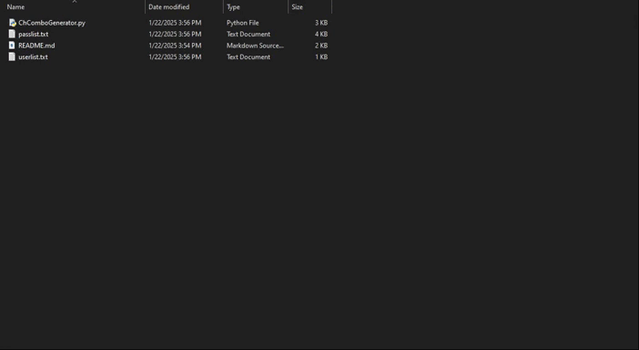

# ChComboGenerator
This is a simple Python script that was created using Python 3, but it can also be run in Python 2. This script helps you when you use cracking tools like NLBrute, etc. It creates a combo list for you using a username list and a password list.

## Project Programmer
> AmirHossein Ghanami (Ch4120N) - Ch4120ni@Gmail.Com

## Made For
> Generating combo lists

## ⚓ Requires
> - Python3
> - Python2

## ⚙️ Installation

```bash
apt update
apt install python git -y
git clone https://github.com/Ch4120N/ChComboGenerator
cd ChComboGenerator
python ChComboGenerator.py
```

### Single line installation
```bash
apt update && apt install python git -y && git clone https://github.com/Ch4120N/ChComboGenerator && && cd ChComboGenerator && python ChComboGenerator.py
```

## 📑 Usage/Example

```
Usage: python ChComboGenerator.py <User List> <Pass List> <Separator>
```

```
Example: python ChComboGenerator.py userlist.txt passlist.txt ";"
```

## 📝️ How it Works?



## 💻 Supported Operating Systems
- [X] Ubuntu/Debian
- [X] Kali Linux
- [X] Arch Linux/Red Hat Linux
- [X] Windows 10/8.1/8/7
- [X] Android (Termux)

## ✨ Features

* Supports Emails
* Support Separator
* Command Line Application
* Easy To Use
* Very High Speed
* Advanced Error Handling
* Free And Open Source

## ⚠️ Legal disclaimer ⚠️
> Usage of `ChComboGenerator` for attacking targets without prior mutual consent is illegal. It's the end user's responsibility to obey all applicable local, state and federal laws. Developers assume no liability and are not responsible for any misuse or damage caused by this program.

## ❤️ Donation 
> BITCOIN:   bc1ql4syps7qpa3djqrxwht3g66tldyh4j7qsyjkq0
> 
> ETHEREUM:  0xfddbd535a4ad28792cbebceee3d6982d774e6d13

## ☠️ Reporting Issues

If you are facing a configuration issue or something is not working as you expected to be, please use the **Ch4120ni@Gmail.com**

